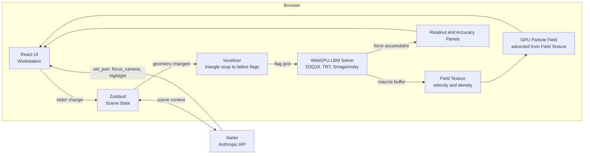
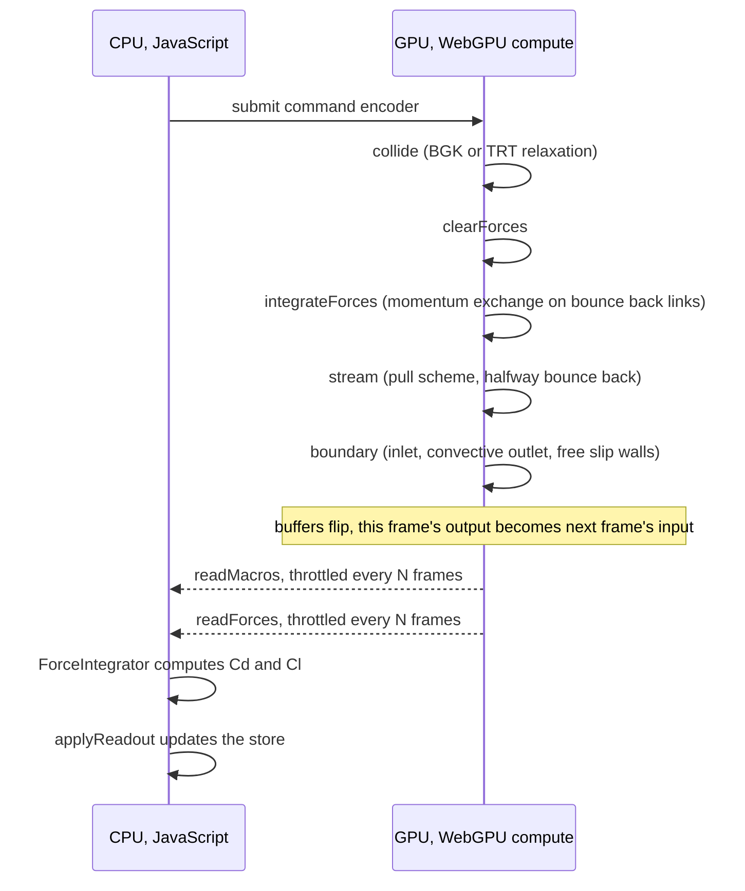
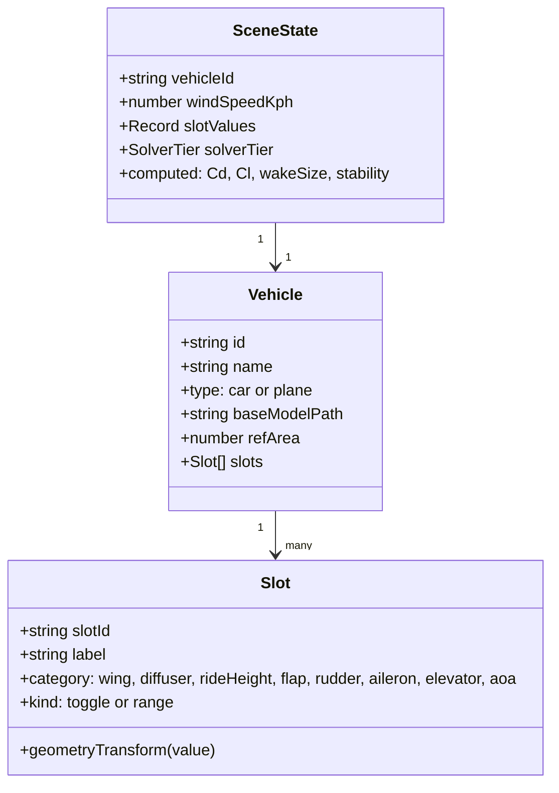
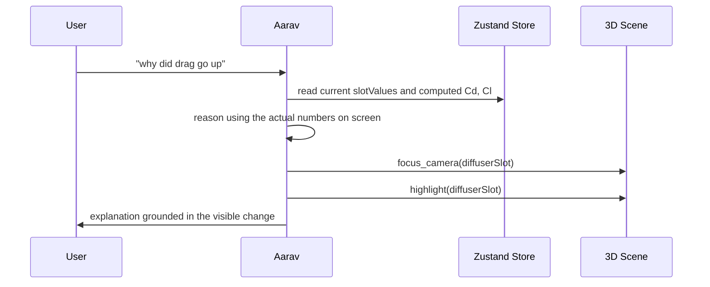
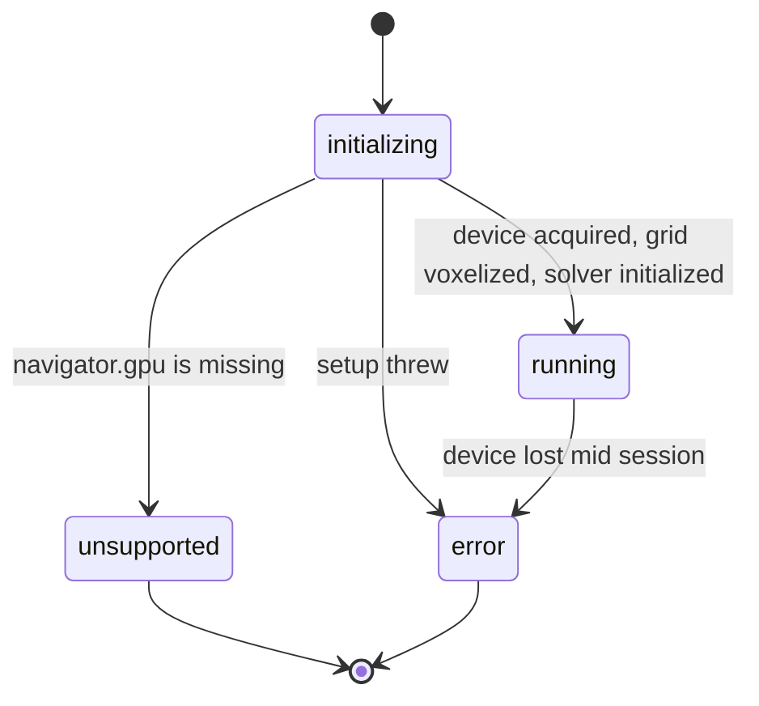
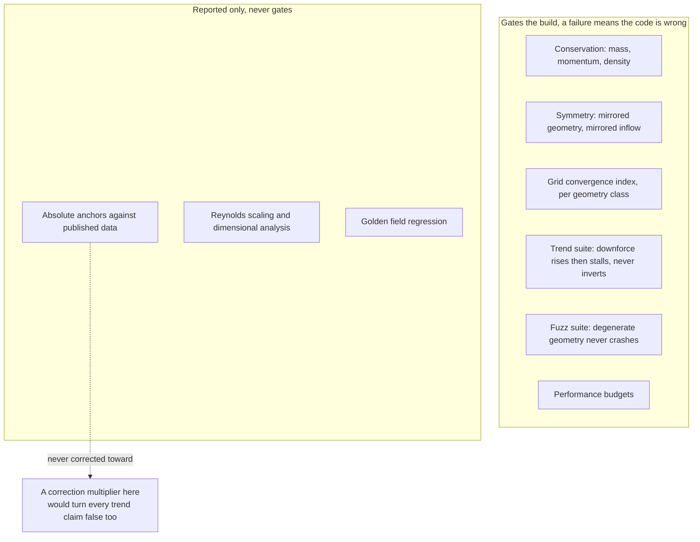

<div align="center">

<h1>AARAV</h1>
<p><strong>Aarav Intelligence</strong>, a play on AI</p>
<p>A GPU-simulated wind tunnel for learning real aerodynamics, in your browser.</p>

<p>
  
  
  
  
  
  
  
  
</p>

</div>

<br />

## Table of contents

- [Overview](#overview)
- [Architecture](#architecture)
- [The solver pipeline](#the-solver-pipeline)
- [Data model](#data-model)
- [How Aarav thinks](#how-aarav-thinks)
- [Solver lifecycle](#solver-lifecycle)
- [Validation philosophy](#validation-philosophy)
- [Status](#status)
- [Features](#features)
- [Tech stack](#tech-stack)
- [Getting started](#getting-started)
- [Project structure](#project-structure)
- [Design principles](#design-principles)
- [Roadmap](#roadmap)
- [License](#license)

<br />

## Overview

Aarav is a wind tunnel that only exists in a browser tab. Adjust a rear wing, drop the ride
height, deploy a rudder, and the airflow recomputes live, because it is being solved on the
GPU in real time rather than pulled from a lookup table.

```
                            AARAV WIND TUNNEL, SIDE VIEW

   inlet                                                                    outlet
     |                                                                         |
     v                                                                         v
   +-------------------------------------------------------------------------+
   |  >  >  >  >                                                             |
   |  >  >  >  >        _______                                             |
   |  >  >  >  >  ,----'       `----.                                       |
   |  >  >  >  > /                   `----___                               |
   |  >  >  >  >/                            `------.......    (wake)       |
   |  >  >  >  >---------------------------oooo------''''''....             |
   |  >  >  >  >                          wheels                            |
   +-------------------------------------------------------------------------+
        free-slip tunnel wall, top and bottom, no boundary layer of its own
```

Aarav, the in-scene AI tutor, watches along with you and explains why a number moved, using
the same values you are looking at on screen, not a separate script written in advance.

<br />

## Architecture



<br />

## The solver pipeline

Every simulated frame runs the same four compute kernels, in the same order, inside a single
WebGPU command encoder. The order is load bearing: force integration reads the population
that collision just wrote, before streaming moves it anywhere.



Reference area, drag, and lift are never declared. They are measured from whichever voxel
flags and force accumulator the current geometry produced, every time.

<br />

## Data model



A new car or plane is added as data against this shape, not as new solver code.

<br />

## How Aarav thinks

Aarav is not a chatbot with the scene bolted on afterward. Every reply has access to the
current `SceneState`, and can act on the scene through tool calls rather than only describing
what to do.



<br />

## Solver lifecycle

`useAaravSimulation` owns the WebGPU device for the whole session. Its state machine is
simple on purpose, because a silent failure here would be worse than a visible one.



`unsupported` and `error` both render a status banner in the 2D UI layer. Neither state is
allowed to fail silently behind a frozen scene.

<br />

## Validation philosophy

Not every check in the suite is allowed to block a build. The distinction is deliberate:
a failing gate always means the code is wrong, a failing advisory check can mean reality is
inconvenient, and the two must never be treated the same way.



<br />

## Status

This section is not marketing copy. The project's own internal rule is that a tool which is
15 percent off and says so is more useful than one that is 5 percent off and implies it is
exact, so this table follows the same standard.

| Piece | Status |
|---|---|
| App shell, UI chrome, 3D viewport | Builds and type checks |
| LBM solver and force integration | Wired to the UI, never run on a real GPU |
| Accuracy and validation harness | Written, never executed |
| Part sliders, wing, diffuser, ride height | Not wired yet |
| Airplane module | Not started |
| WebGL2 fallback tier | Not built, WebGPU only for now |

If this breaks in the console on first load, that is expected, not a regression.

<br />

## Features

<table>
<tr>
<td width="50%" valign="top">

**Real flow, not animation**
A D3Q19 Lattice Boltzmann solver runs on WebGPU compute shaders. Streamlines, wake, and
separation emerge from the physics instead of being scripted.

**Tunable parts**
Rear wing angle, diffuser, independent front and rear ride height, with flaps, rudder, and
ailerons planned for the airplane module.

</td>
<td width="50%" valign="top">

**Aarav, the tutor**
Scene aware, able to move the camera, highlight a part, and adjust a slider mid explanation
instead of only describing what to try.

**Honesty by design**
A live accuracy panel reports statistical confidence, resolution, blockage ratio, and
Reynolds regime. Accuracy against published data is tracked and never corrected toward.

</td>
</tr>
</table>

<br />

## Tech stack

| Layer | Choice |
|---|---|
| UI | React, TypeScript, Tailwind CSS |
| 3D scene | React Three Fiber, Three.js |
| Simulation | WebGPU compute shaders, D3Q19 Lattice Boltzmann |
| State | Zustand |
| AI tutor | Claude, Anthropic API, backend integration pending |

<br />

## Getting started

```bash
npm install
npm run dev         # http://localhost:5173, needs a WebGPU capable browser
npm run typecheck    # tsc --noEmit
npm run build        # production build into dist/
```

<br />

## Project structure

```
src/
  components/     UI chrome and 3D scene components
  engine/
    webgpu/       LBM compute kernels and solver class
    voxel/        triangle to lattice voxelization
    geometry/     geometry helpers
  render/         particle field, flow texture
  store/          Zustand scene state
  validation/     accuracy harness, conservation, symmetry, GCI, trends
docs/             spec addenda for the turbulence model and wall functions
plans/, prompts/  the planning documents this project grew from
```

<br />

## Design principles

- No correction multipliers, ever. If an output needs to be multiplied to match a published
  value, the multiplier is defined by the answer it produces, not by physics.
- Trends must never invert. More wing angle must always cost more drag. A wrong trend is a
  bug, not a rounding error.
- Uncertainty is always stated, and the disclaimer does not shrink as the numbers improve.
- A missing citation is reported as a gap, not filled in with a plausible looking estimate.
- Absolute accuracy against real world data is a diagnostic, not a target this build gates on.

<br />

## Roadmap

- [x] Phase 0, render pipeline and placeholder vehicle
- [x] Phase 1 partial, LBM solver wired to a live readout panel
- [ ] Part and slider wiring with re-voxelization
- [ ] WebGL2 fallback tier
- [ ] Airplane module, flaps, rudder, ailerons, stall behavior
- [ ] Aarav backend, real Anthropic API tool calling into the scene

<br />

## License

No license - you can fork it 
